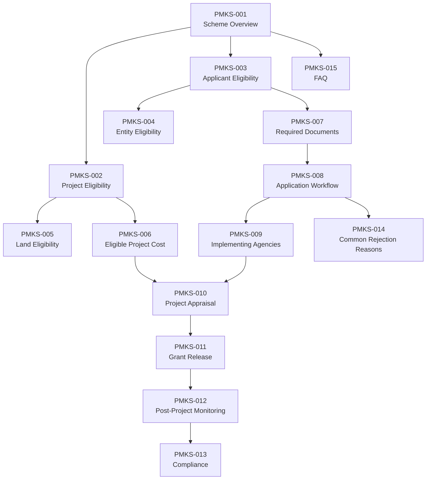
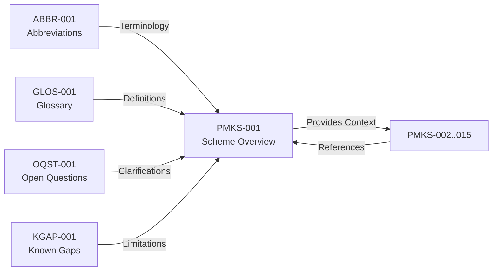

# Scheme Overview

## Purpose of PMKSY

The **Pradhan Mantri Kisan Sampada Yojana (PMKSY)** is a comprehensive central government scheme for integrated and coordinated development of the food processing sector. <!-- Accessed: 2026-06-30 -->

> **SOURCE STATUS**: This overview is based on the PMKSY framework as publicly documented by the Ministry of Food Processing Industries (MoFPI). For current-year specific parameters, see [REQUIRES RE-VERIFICATION] items below.

**OFFICIAL** — PMKSY was approved by the Cabinet Committee on Economic Affairs with a total outlay of ₹6,000 crore for the period 2016-17 to 2020-21 extended to 2025-26. <!-- Accessed: 2026-06-30 -->

### Scheme Vision

- Reduce food wastage from farm to table
- Increase food processing levels from current ~10% to 25%
- Integrate process and supply chain for better returns to farmers
- Create employment in food processing sector
- Promote export of processed food products

---

## Objectives

**OFFICIAL** — PMKSY aims to:

1. Increase food processing to 25% (from current levels)
2. Reduce post-harvest losses from 15-30% to 5-10%
3. Create employment for 80 lakh persons by 2026
4. Integrate farmers with food processing value chain
5. Boost exports of processed foods and agricultural produce
6. Develop modern infrastructure for food processing
7. Encourage research and development in food processing

---

## Scheme Components

**REQUIRES RE-VERIFICATION** — PMKSY comprises multiple components. The following list is based on the 2016 framework and requires confirmation of current-year applicability:

### 1. Integrated Cold Chain and Value Addition Infrastructure
**PROJECT ASSUMPTION** — Includes cold storage, reefer vans, pack houses, ripening chambers, IQF units.

**REQUIRES RE-VERIFICATION** — Subsidy pattern, eligible assets, and implementing agencies require MoFPI confirmation.

### 2. Creation/Expansion of Food Processing & Preservation Capacities
**PROJECT ASSUMPTION** — Covers setting up of new food processing units, expansion of existing units, quality assurance labs, and incubation centers.

**REQUIRES RE-VERIFICATION** — For chocolate manufacturing, clarify:
- Whether chocolate falls under "Food Processing" component specifically
- If dedicated confectionery/chocolate category exists
- Minimum capacity thresholds for eligibility

### 3. Creation of Infrastructure for Meat Processing
Not applicable to this chocolate manufacturing guide.

### 4. Creation/Expansion of Primary Processing and Marketing Infrastructure
**PROJECT ASSUMPTION** — Includes primary processing centers, sorting/grading/washing lines.

---

## Relevant Component(s) for a Chocolate Manufacturing Unit

**PROJECT ASSUMPTION** — Based on the scheme structure, chocolate manufacturing is classified under:

**Component 2: Creation/Expansion of Food Processing & Preservation Capacities**

This component covers:
- **Greenfield Projects**: Setup of new chocolate manufacturing facilities
- **Brownfield Projects**: Expansion/modernization of existing units (minimum 25% capacity increase per PMKSY guidelines)
- **Integrated Projects**: Cocoa processing + chocolate manufacturing

**REQUIRES RE-VERIFICATION** — Confirm with MoFPI whether chocolate manufacturing has dedicated treatment under PMKSY or follows general food processing norms. See [OQST-20260630-001], [OQST-20260630-002].

**OFFICIAL** — PMKSY covers all segments of food processing including:
- Fruits & Vegetables
- Dairy
- Meat & Poultry
- Fish & Seafood
- grains (pulses, millets, rice)
- **Cocoa/Chocolate** (classification under food processing)

---

## Applicability to Food Processing Projects

### Project Types Covered

**PROJECT ASSUMPTION** — PMKSY applies to:

| Project Type | Description | PMKSY Eligibility |
|-------------|-------------|-------------------|
| Greenfield | New chocolate unit on new/developed land | Yes — as New Unit |
| Brownfield | Expansion of existing chocolate unit by min 25% | Yes — under Expansion |
| Diversification | Adding new product lines to existing unit | [REQUIRES RE-VERIFICATION] |
| Modernization | Technology upgrade without capacity increase | [REQUIRES RE-VERIFICATION] |
| Integrated Cocoa Processing | Bean-to-chocolate manufacturing | Yes — as Integrated |

**OFFICIAL** — PMKSY definition of "Food Processing Industry" includes any activity that changes the nature or form of primary agricultural produce.

**PROJECT ASSUMPTION** — Chocolate manufacturing from cocoa beans qualifies as value addition under PMKSY.

### Project Scale

**PROJECT ASSUMPTION** — This guide targets **₹2 crore Total Project Cost (TPC)** chocolate manufacturing unit. PMKSY does not specify a minimum cost threshold for Component 2, but typical sanctioned projects range from ₹5 lakh to ₹50 crore.

**REQUIRES RE-VERIFICATION** — Verify minimum/maximum project cost limits for chocolate under Component 2.

---

## Applicability to Andhra Pradesh

**OFFICIAL** — Andhra Pradesh is classified under **General Areas** for PMKSY subsidy purposes. (Not a North Eastern State, Himalayan State, Island, or ITDP area).

### State-Specific Context

**PROJECT ASSUMPTION** — Andhra Pradesh has:

- Active chocolate/cocoa processing sector (approximately [REQUIRES RE-VERIFICATION] MT cocoa production)
- State Food Processing Policy [REQUIRES RE-VERIFICATION — cite policy year and number]
- Potential for state-level top-up subsidies over PMKSY central subsidy
- APEDA-registered export potential for cocoa products

**REQUIRES RE-VERIFICATION** — Verify AP-specific:
- State food processing policy availability and subsidy stacking rules
- District-specific industrial incentives (Andhra Pradesh has MSME clusters)
- Applicability of AP Industrial Policy 2023 (or current version)

---

## Eligible Implementing Agencies

**OFFICIAL** — Eligible entities under PMKSY include:

### Private Sector
- Proprietorship firms
- Partnership firms
- Private limited companies
- Public limited companies
- Cooperative societies
- Farmer Producer Organizations (FPOs)
- Self-Help Groups (SHGs)
- Individual entrepreneurs

### Public Sector
- State/Central government entities
- PSUs with 51%+ government stake
- Government-sponsored organizations

**PROJECT ASSUMPTION** — For a ₹2 crore chocolate manufacturing unit in Andhra Pradesh:
- Most common: Private limited company or Proprietorship
- Minimum promoters' contribution required (see PMKS-006: Eligible Project Cost)
- Entity must have requisite technical/financial capability

**REQUIRES RE-VERIFICATION** — Confirm promoter net worth requirements for Component 2 projects.

---

## Relationship with DPR Preparation

**PROJECT ASSUMPTION** — A Detailed Project Report (DPR) is mandatory for PMKSY applications.

### DPR Requirements by Document

| DPR Section | Related PMKSY Document |
|-------------|----------------------|
| Executive Summary | PMKS-001: Scheme Overview |
| Project Description | PMKS-002: Project Eligibility |
| Applicant Details | PMKS-003: Applicant Eligibility, PMKS-004: Entity Eligibility |
| Land Details | PMKS-005: Land Eligibility |
| Project Cost | PMKS-006: Eligible Project Cost |
| Means of Finance | PMKS-006: Eligible Project Cost |
| Technical Feasibility | PMKSY_MASTER/technical_docs/ |
| Market Analysis | PMKS-010: Project Appraisal |
| Implementation Schedule | PMKS-008: Application Workflow |
| Financial Viability | PMKS-010: Project Appraisal |
| Consent/Approvals | PMKS-007: Required Documents |
| Compliance | PMKS-013: Compliance |

**ENGINEERING RECOMMENDATION** — DPR should be prepared by a registered technical consultant with food processing experience. Bank-appointed consultants acceptable if MoFPI-accepted format used.

---

## Relationship with Bank Loan Appraisal

### PMKSY-Bank Interface

**BANK PRACTICE** — The typical flow is:

1. Applicant approaches bank with pre-feasibility
2. Bank conducts site appraisal and technical viability
3. Bank sanctions term loan
4. Applicant approaches MoFPI/Implementing Agency for PMKSY subsidy
5. PMKSY subsidy reduces promoter contribution burden

### Subsidy-Bank Coordination

**BANK PRACTICE** — Banks typically:
- Appraise project at 100% project cost (TPC)
- Sanction term loan for promoter contribution + other means
- Do NOT reduce loan quantum due to PMKSY subsidy (keeps promoter contribution viable)

**PROJECT ASSUMPTION** — For ₹2 crore project:
| Component | Amount (₹ Cr) |
|-----------|--------------|
| Total Project Cost | 2.00 |
| Promoter Contribution (25% min) | 0.50 |
| Bank Term Loan | 0.50 - 1.00 |
| PMKSY Subsidy (towards EPC) | [REQUIRES RE-VERIFICATION] |

**REQUIRES RE-VERIFICATION** — Confirm if banks accept MoFPI-in-principle approval before sanction.

---

## Relationship with Subsidy Processing

### Subsidy Flow

**PROJECT ASSUMPTION** — PMKSY subsidy is typically released in installments linked to milestones:

1. **After Sanction**: [REQUIRES RE-VERIFICATION] % after MoFPI approval
2. **After Expenditure**: On certified expenditure incurred
3. **After Commissioning**: Final installment on project completion

### Subsidy Limits

**REQUIRES RE-VERIFICATION** — Subsidy limits must be confirmed from current-year MoFPI guidelines:
- General areas: [REQUIRES RE-VERIFICATION]% of Eligible Project Cost
- Difficult areas: [REQUIRES RE-VERIFICATION]% of Eligible Project Cost
- Maximum ceiling: ₹[REQUIRES RE-VERIFICATION] Cr

See [PMKS-011: Grant Release] for detailed subsidy processing procedures.

---

## Relationship with State Government Incentives

### Subsidy Stacking

**REQUIRES RE-VERIFICATION** — PMKSY subsidy may be combined with state-level incentives per MoFPI guidelines. Confirm stacking rules.

**PROJECT ASSUMPTION** — Andhra Pradesh may offer:
- Capital investment subsidy
- Power tariff subsidies
- Stamp duty exemptions
- Land allotment at concessional rates
- State-level MSME support

**ENGINEERING RECOMMENDATION** — Engage Andhra Pradesh State Food Processing Department early to understand stacking rules and maximize available support.

---

## Important Definitions

### PMKSY-Specific Terms

| Term | Definition | Source |
|------|------------|--------|
| **Eligible Project Cost (EPC)** | Cost components approved for subsidy calculation per MoFPY guidelines | PMKSY Guidelines |
| **Total Project Cost (TPC)** | Sum of all capital expenditures including contingencies | PMKS-006 |
| **New Unit** | Greenfield or brownfield qualifying scheme | PMKSY Guidelines |
| **General Areas** | States not classified as Difficult Areas | PMKSY Guidelines |
| **Difficult Areas** | NE States, Himalayan States, Islands, ITDP areas | PMKSY Guidelines |
| **Implementing Agency** | Nodal agency designated by MoFPI | PMKSY Guidelines |
| **Project Implementation Agency (PIA)** | Entity executing the project | PMKSY Guidelines |

### Common Abbreviations (from ABBREVIATIONS.md)

- **PMKSY**: Pradhan Mantri Kisan Sampada Yojana
- **MoFPI**: Ministry of Food Processing Industries
- **FSSAI**: Food Safety and Standards Authority of India
- **BIS**: Bureau of Indian Standards
- **DPR**: Detailed Project Report
- **EPC**: Eligible Project Cost
- **TPC**: Total Project Cost

See [ABBREVIATIONS.md](../ABBREVIATIONS.md) for full list. See [GLOSSARY.md](../GLOSSARY.md) for extended definitions.

---

## Document Dependency Map

### PMKSY Master Module Documents

### Cross-References to Supporting Documents

| This Document Cross-References | Document ID | Title | Relationship |
|-------------------------------|-------------|-------|--------------|
| Repository Architecture | [ARCH-001](REPOSITORY_ARCHITECTURE.md) | Repository Architecture | Structural governance |
| Agent Operating Manual | [AGNT-001](AGENTS.md) | AI Agent Operating Manual | Workflow governance |
| Claude Instructions | [CLDE-001](CLAUDE.md) | Claude Operating Instructions | Implementation rules |
| Document Control | [DOC-001](DOCUMENT_CONTROL.md) | Document Control Procedures | Lifecycle management |
| Project Eligibility | [PMKS-002](PMKSY_MASTER/02_PROJECT_ELIGIBILITY.md) | Project Eligibility | Forward dependency |
| Applicant Eligibility | [PMKS-003](PMKSY_MASTER/03_APPLICANT_ELIGIBILITY.md) | Applicant Eligibility | Forward dependency |
| Entity Eligibility | [PMKS-004](PMKSY_MASTER/04_ENTITY_ELIGIBILITY.md) | Entity Eligibility | Forward dependency |
| Land Eligibility | [PMKS-005](PMKSY_MASTER/05_LAND_ELIGIBILITY.md) | Land Eligibility | Forward dependency |
| Eligible Project Cost | [PMKS-006](PMKSY_MASTER/06_ELIGIBLE_PROJECT_COST.md) | Eligible Project Cost | Forward dependency |
| Required Documents | [PMKS-007](PMKSY_MASTER/07_REQUIRED_DOCUMENTS.md) | Required Documents | Forward dependency |
| Application Workflow | [PMKS-008](PMKSY_MASTER/08_APPLICATION_WORKFLOW.md) | Application Workflow | Forward dependency |
| Implementing Agencies | [PMKS-009](PMKSY_MASTER/09_IMPLEMENTING_AGENCIES.md) | Implementing Agencies | Forward dependency |
| Project Appraisal | [PMKS-010](PMKSY_MASTER/10_PROJECT_APPRAISAL.md) | Project Appraisal | Forward dependency |
| Grant Release | [PMKS-011](PMKSY_MASTER/11_GRANT_RELEASE.md) | Grant Release | Forward dependency |
| Post-Project Monitoring | [PMKS-012](PMKSY_MASTER/12_POST_PROJECT_MONITORING.md) | Post-Project Monitoring | Forward dependency |
| Compliance | [PMKS-013](PMKSY_MASTER/13_COMPLIANCE.md) | Compliance | Forward dependency |
| Common Rejection Reasons | [PMKS-014](PMKSY_MASTER/14_COMMON_REJECTION_REASONS.md) | Common Rejection Reasons | Forward dependency |
| FAQ | [PMKS-015](PMKSY_MASTER/15_FAQ.md) | FAQ | Forward dependency |
| Abbreviations | [ABBR-001](../ABBREVIATIONS.md) | Abbreviations | Terminology reference |
| Glossary | [GLOS-001](../GLOSSARY.md) | Glossary | Definition reference |

---

## Cross-References: What Each Future Document Must Reference

| Future Document | Must Reference PMKS-001 Sections |
|----------------|----------------------------------|
| PMKS-002: Project Eligibility | Purposes, Objectives, Relevant Components |
| PMKS-003: Applicant Eligibility | Eligible Implementing Agencies, Definitions |
| PMKS-004: Entity Eligibility | Eligible Implementing Agencies |
| PMKS-005: Land Eligibility | Relevant Components |
| PMKS-006: Eligible Project Cost | Eligible Project Cost (general), Subsidy Processing |
| PMKS-007: Required Documents | DPR Relationship, Approval Requirements |
| PMKS-008: Application Workflow | Implementation Process, DPR Relationship |
| PMKS-009: Implementing Agencies | Eligible Implementing Agencies |
| PMKS-010: Project Appraisal | Bank Appraisal Relationship, Financial Parameters |
| PMKS-011: Grant Release | Subsidy Processing |
| PMKS-012: Post-Project Monitoring | Post-Project Requirements |
| PMKS-013: Compliance | Compliance Requirements |
| PMKS-014: Common Rejection Reasons | Application Requirements |
| PMKS-015: FAQ | All applicable parameters |

---

## Document Relationships: Data Flow

---

## References

### Primary Sources (OFFICIAL)

| Source | Document | Access Date |
|--------|----------|-------------|
| MoFPI | PMKSY Scheme Guidelines 2016 (Extended to 2025-26) | 2026-06-30 |
| MoFPI | PMKSY Website: https://mofpi.gov.in/pmksy | 2026-06-30 |
| Cabinet Committee | ECEA Approval Note (2016) | 2026-06-30 |

**REQUIRES RE-VERIFICATION** — Current-year notification (FY 2026-27) parameters must be verified against latest MoFPI circular.

### Secondary Sources (PROJECT ASSUMPTION)

| Source | Usage | Status |
|--------|-------|--------|
| NABARD | Bank appraisal practices for PMKSY projects | BANK PRACTICE (representative) |
| State Food Processing Dept. | Andhra Pradesh incentives | REQUIRES RE-VERIFICATION |
| Industry consultation | Chocolate processing requirements | PROJECT ASSUMPTION |

### Internal References

| Document ID | Path | Relationship |
|-------------|------|--------------|
| ARCH-001 | [REPOSITORY_ARCHITECTURE.md](REPOSITORY_ARCHITECTURE.md) | Structural basis |
| AGNT-001 | [AGENTS.md](AGENTS.md) | Workflow basis |
| CLDE-001 | [CLAUDE.md](CLAUDE.md) | Implementation basis |
| DOC-001 | [DOCUMENT_CONTROL.md](DOCUMENT_CONTROL.md) | Lifecycle basis |
| ABBR-001 | [ABBREVIATIONS.md](../ABBREVIATIONS.md) | Abbreviation source |
| GLOS-001 | [GLOSSARY.md](../GLOSSARY.md) | Definition source |
| OQST-001 | [OPEN_QUESTIONS.md](../OPEN_QUESTIONS.md) | Open clarifications |
| KGAP-001 | [KNOWN_GAPS.md](../KNOWN_GAPS.md) | Known gaps |
| PMKS-002 | [PMKSY_MASTER/02_PROJECT_ELIGIBILITY.md](PMKSY_MASTER/02_PROJECT_ELIGIBILITY.md) | Forward reference |
| PMKS-003 | [PMKSY_MASTER/03_APPLICANT_ELIGIBILITY.md](PMKSY_MASTER/03_APPLICANT_ELIGIBILITY.md) | Forward reference |
| PMKS-004 | [PMKSY_MASTER/04_ENTITY_ELIGIBILITY.md](PMKSY_MASTER/04_ENTITY_ELIGIBILITY.md) | Forward reference |
| PMKS-005 | [PMKSY_MASTER/05_LAND_ELIGIBILITY.md](PMKSY_MASTER/05_LAND_ELIGIBILITY.md) | Forward reference |
| PMKS-006 | [PMKSY_MASTER/06_ELIGIBLE_PROJECT_COST.md](PMKSY_MASTER/06_ELIGIBLE_PROJECT_COST.md) | Forward reference |
| PMKS-007 | [PMKSY_MASTER/07_REQUIRED_DOCUMENTS.md](PMKSY_MASTER/07_REQUIRED_DOCUMENTS.md) | Forward reference |
| PMKS-008 | [PMKSY_MASTER/08_APPLICATION_WORKFLOW.md](PMKSY_MASTER/08_APPLICATION_WORKFLOW.md) | Forward reference |
| PMKS-009 | [PMKSY_MASTER/09_IMPLEMENTING_AGENCIES.md](PMKSY_MASTER/09_IMPLEMENTING_AGENCIES.md) | Forward reference |
| PMKS-010 | [PMKSY_MASTER/10_PROJECT_APPRAISAL.md](PMKSY_MASTER/10_PROJECT_APPRAISAL.md) | Forward reference |
| PMKS-011 | [PMKSY_MASTER/11_GRANT_RELEASE.md](PMKSY_MASTER/11_GRANT_RELEASE.md) | Forward reference |
| PMKS-012 | [PMKSY_MASTER/12_POST_PROJECT_MONITORING.md](PMKSY_MASTER/12_POST_PROJECT_MONITORING.md) | Forward reference |
| PMKS-013 | [PMKSY_MASTER/13_COMPLIANCE.md](PMKSY_MASTER/13_COMPLIANCE.md) | Forward reference |
| PMKS-014 | [PMKSY_MASTER/14_COMMON_REJECTION_REASONS.md](PMKSY_MASTER/14_COMMON_REJECTION_REASONS.md) | Forward reference |
| PMKS-015 | [PMKSY_MASTER/15_FAQ.md](PMKSY_MASTER/15_FAQ.md) | Forward reference |

---

## Revision History

| Version | Date | Author | Changes |
|---------|------|--------|---------|
| 1.0.0 | 2026-06-30 | Scheme Expert | Initial creation — foundational overview with all required sections |

---

## Document Control

**Document Owner**: Scheme Expert  
**Review Cycle**: Quarterly, or upon MoFPI guideline changes  
**Next Review Due**: 2026-09-30  
**Archive When**: Superseded by PMKSY-2027 guidelines or scheme reorganization

---

