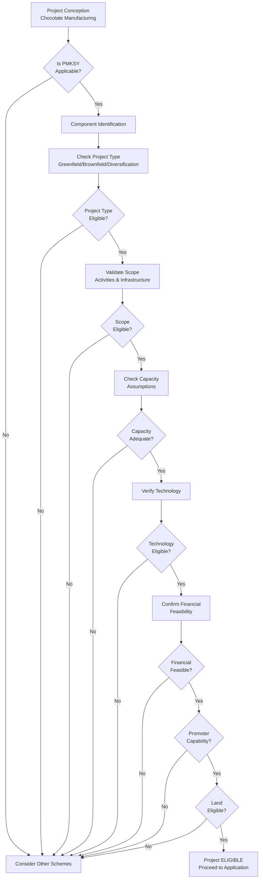

# Project Eligibility

## Purpose of Project Eligibility

Project eligibility determines whether a proposed chocolate manufacturing project qualifies for PMKSY consideration, independent of who the applicant is or what legal entity is used. This document establishes the project-level criteria that must be satisfied before any application proceeds.

**OFFICIAL** — PMKSY project eligibility is determined by the implementing agency based on the scheme guidelines and component-specific criteria. The applicant must demonstrate that the proposed project aligns with scheme objectives and meets all project-level conditions.

> **SCOPE BOUNDARY**: This document covers project-level eligibility only. Applicant eligibility is covered in [PMKS-003: Applicant Eligibility](PMKSY_MASTER/03_APPLICANT_ELIGIBILITY.md). Entity eligibility is covered in [PMKS-004: Entity Eligibility](PMKSY_MASTER/04_ENTITY_ELIGIBILITY.md). Land eligibility is covered in [PMKS-005: Land Eligibility](PMKSY_MASTER/05_LAND_ELIGIBILITY.md).

---

## Project Categories Covered Under PMKSY

**PROJECT ASSUMPTION** — Based on the PMKSY framework, projects are generally categorized as:

### Greenfield Projects
- New chocolate manufacturing facilities on previously undeveloped land
- Integration of cocoa processing and chocolate manufacturing at greenfield sites
- Expansion within existing premises that qualifies as a new unit

### Brownfield Projects
- Expansion or modernization of existing chocolate manufacturing facilities
- **PROJECT ASSUMPTION** — PMKSY typically requires minimum 25% increase in installed capacity to qualify as expansion
- Technology upgradation that results in measurable capacity or efficiency improvement

### Diversification Projects
- Adding new product lines to existing food processing units
- **REQUIRES RE-VERIFICATION** — Confirm whether diversification in chocolate products qualifies under PMKSY without capacity increase

### Rehabilitation Projects
- **REQUIRES RE-VERIFICATION** — Confirm whether chronically sick units qualify for PMKSY support under specific conditions

---

## Food Processing Sector Applicability

**OFFICIAL** — PMKSY covers the entire food processing sector including, but not limited to:

| Sector | Sub-sectors |
|--------|-------------|
| Fruits & Vegetables | Fresh produce, juices, purees, frozen vegetables |
| Dairy | Milk processing, dairy products |
| Meat & Poultry | Slaughter houses, meat processing, cold chain |
| Fish & Seafood | Aquaculture, fish processing, value addition |
| Grains & Cereals | Milling, pulse processing, rice processing |
| Oilseeds | Extraction, refining |
| Cocoa/Chocolate | Fermentation, drying, roasting, grinding, conching, moulding, packaging |

**ENGINEERING RECOMMENDATION** — For chocolate manufacturing, the project should demonstrate clear value addition from raw cocoa beans to finished chocolate products to qualify under food processing.

---

## Chocolate Manufacturing Applicability

### How Eligibility Must Be Determined

**PROJECT ASSUMPTION** — Chocolate manufacturing eligibility under PMKSY must be determined by:

1. **Component Classification**: Determine which PMKSY component applies (see [PMKS-001: Scheme Overview](PMKSY_MASTER/01_SCHEME_OVERVIEW.md))
   - **PROJECT ASSUMPTION** — Likely Component 2: Creation/Expansion of Food Processing & Preservation Capacities

2. **Scheme Circular Review**: Consult current-year MoFPI circular for:
   - Specific eligibility conditions for food processing
   - Any confectionery-specific provisions
   - Capacity thresholds or exclusions

3. **Value Addition Threshold**: Demonstrate that the project adds value beyond primary processing
   - **PROJECT ASSUMPTION** — Roasting, grinding, refining, conching, tempering, moulding constitute value addition

### Conditions That Must Be Verified

| Condition | Verification Required | Reference |
|-----------|----------------------|-----------|
| Component applicability for chocolate | REQUIRES RE-VERIFICATION | OQST-20260630-002 |
| Minimum capacity threshold | REQUIRES RE-VERIFICATION | OQST-20260630-006 |
| Equipment eligibility | REQUIRES RE-VERIFICATION | OQST-20260630-002 |
| Value addition criteria | ENGINEERING RECOMMENDATION | Project-specific DPR |
| Subsidy stacking rules | REQUIRES RE-VERIFICATION | OQST-20260630-007 |

### Confirmed vs. Assumed Guidance

| Guidance Level | Application |
|----------------|-------------|
| **Confirmed (OFFICIAL)** | PMKSY covers food processing; chocolate manufacturing is value addition |
| **Assumed (PROJECT ASSUMPTION)** | Component 2 is the applicable component; typical eligibility conditions |
| **Uncertain (REQUIRES RE-VERIFICATION)** | Chocolate-specific thresholds, equipment lists, maximum subsidy rates |

---

## Eligible Project Types

### Greenfield Chocolate Manufacturing Unit

**PROJECT ASSUMPTION** — Eligible if:
- New unit with minimum capacity of [REQUIRES RE-VERIFICATION] MT/year
- Complete processing line from cocoa beans to finished chocolate
- Located on eligible land with requisite approvals

### Brownfield Expansion

**PROJECT ASSUMPTION** — Eligible if:
- Existing chocolate unit expanding capacity by minimum 25%
- Technology modernization with measurable efficiency gains
- Clear demarcation of existing vs. expanded facilities

### Integrated Cocoa Processing + Chocolate Manufacturing

**PROJECT ASSUMPTION** — Eligible as:
- Cocoa processing (primary) + chocolate manufacturing (secondary)
- Full value chain from bean to bar/bulk chocolate
- Both activities may be funded under same project

### Ancillary/Supporting Projects

**REQUIRES RE-VERIFICATION** — Confirm eligibility of:
- Cocoa butter refining units
- Chocolate packaging facilities
- Flavor compound manufacturing (may fall under different component)

---

## Eligible Activities

**PROJECT ASSUMPTION** — Eligible activities for chocolate manufacturing under PMKSY:

| Activity | Eligibility | Condition |
|----------|-------------|-----------|
| Cocoa bean procurement | Yes | Part of input supply chain |
| Bean cleaning/sorting | Yes | Primary processing |
| Roasting | Yes | Processing step |
| Winnowing | Yes | Nib separation |
| Grinding (cocoa mass production) | Yes | Core processing |
| Refining | Yes | Particle size reduction |
| Conching | Yes | Flavor/texture development |
| Tempering | Yes | Critical quality step |
| Moulding | Yes | Final shaping |
| Enrobing | Yes | Product diversification |
| Cooling | Yes | Final processing |
| Packaging | Yes | Final step before dispatch |
| Quality testing lab | Yes | Supporting infrastructure |
| Warehouse/storage | Yes | Supporting infrastructure |

**REQUIRES RE-VERIFICATION** — Confirm if ancillary activities like cocoa butter pressing, lecithin addition, or flavor creation have specific eligibility conditions.

---

## Eligible Processing Infrastructure

**PROJECT ASSUMPTION** — Eligible infrastructure for chocolate manufacturing:

### Production Equipment
- Roasters (batch/continuous)
- Winnowing machines
- Ball mills / refiner mills
- Conche machines (long/short)
- Tempering machines
- Moulding lines (depositing, enrobing)
- Cooling tunnels
- Packaging machines (flow pack, thermoform, etc.)

### Support Infrastructure
- Raw material storage (cocoa beans)
- Intermediate storage (cocoa mass, chocolate mass)
- Finished goods warehouse
- Quality control laboratory
- Utility systems (see eligible technologies below)

**REQUIRES RE-VERIFICATION** — Confirm specific equipment eligibility from MoFPI/nodal agency equipment lists if available.

---

## Eligible Technologies

**ENGINEERING RECOMMENDATION** — Technologies eligible under PMKSY for chocolate manufacturing:

| Technology | Eligibility | Justification |
|------------|-------------|---------------|
| Automated roasting systems | Eligible | Reduces labor, improves consistency |
| Continuous conching | Eligible | Superior product quality |
| Automated tempering | Eligible | Quality assurance, repeatability |
| Energy-efficient cooling | Eligible | Power savings, sustainability |
| Waste heat recovery | Eligible | Energy efficiency |
| Water recycling | Eligible | Environmental compliance |
| IoT-based monitoring | Eligible | Industry 4.0 compliance |
| Automated packaging | Eligible | Hygiene, throughput |

**REQUIRES RE-VERIFICATION** — Confirm if energy efficiency or Industry 4.0 technologies attract higher subsidies or special provisions.

---

## General Project Eligibility Conditions

**PROJECT ASSUMPTION** — General conditions that apply to all PMKSY chocolate manufacturing projects:

### Financial Conditions
- **REQUIRES RE-VERIFICATION** — Minimum promoter contribution percentage
- **REQUIRES RE-VERIFICATION** — Maximum project cost limits for Component 2
- **REQUIRES RE-VERIFICATION** — Bank term loan requirements (if any)
- **REQUIRES RE-VERIFICATION** — Own funds requirements

### Technical Conditions
- Project must be technically feasible
- Technology must be commercially proven (see [PMKS-010: Project Appraisal](PMKSY_MASTER/10_PROJECT_APPRAISAL.md))
- Environmental clearances obtained or applicable (see [PMKS-013: Compliance](PMKSY_MASTER/13_COMPLIANCE.md))
- Land is eligible (see [PMKS-005: Land Eligibility](PMKSY_MASTER/05_LAND_ELIGIBILITY.md))

### Operational Conditions
- **REQUIRES RE-VERIFICATION** — Minimum project completion timeline
- **REQUIRES RE-VERIFICATION** — Operational period commitments post-completion
- **REQUIRES RE-VERIFICATION** — Employment generation commitments

### Compliance Conditions
- Must comply with all applicable statutes (FSSAI, BIS, environmental, labor)
- DPR must be prepared (see Relationship with DPR Preparation below)
- All required documents submitted (see [PMKS-007: Required Documents](PMKSY_MASTER/07_REQUIRED_DOCUMENTS.md))

---

## Project-Level Disqualifications

**PROJECT ASSUMPTION** — Projects are disqualified if:

### Automatic Disqualifications
- Project does not fall under PMKSY components
- Applicant is ineligible (see [PMKS-003: Applicant Eligibility](PMKSY_MASTER/03_APPLICANT_ELIGIBILITY.md))
- Land is ineligible (see [PMKS-005: Land Eligibility](PMKSY_MASTER/05_LAND_ELIGIBILITY.md))
- Project involves prohibited activities

### Conditional Disqualifications
- **REQUIRES RE-VERIFICATION** — Existing dues to government institutions
- **REQUIRES RE-VERIFICATION** — Prior default in bank loans
- **REQUIRES RE-VERIFICATION** — Promoters lacking technical/financial capability
- **REQUIRES RE-VERIFICATION** — Incomplete documentation

### Chocolate-Specific Disqualifications
- **REQUIRES RE-VERIFICATION** — Projects importing cocoa butter and merely repackaging (no value addition)
- **REQUIRES RE-VERIFICATION** — Projects located in prohibited zones (e.g., residential areas without conversion)
- **REQUIRES RE-VERIFICATION** — Projects without adequate power/water infrastructure

---

## Capacity or Scale Considerations

**REQUIRES RE-VERIFICATION** — The following capacity guidelines are based on industry norms and PROJECT ASSUMPTION. Official PMKSY thresholds must be confirmed.

### Minimum Capacity Assumptions

| Product Type | Assumed Minimum Capacity | Basis |
|-------------|-------------------------|-------|
| Plain/Milk Chocolate | 500 MT/year | Economic viability |
| Dark Chocolate | 300 MT/year | Smaller batch premium products |
| Compound Chocolate | 1000 MT/year | Larger market, lower margin |
| Cocoa Powder | 200 MT/year | Cocoa processing byproduct |

**REQUIRES RE-VERIFICATION** — Official PMKSY may specify different minimums or no minimum for Component 2 projects.

### Capacity Definitions

- **Installed Capacity**: Maximum rated capacity as per design and equipment specifications
- **Utilized Capacity**: Actual production achieved per annum
- **Technology Capacity**: Capacity achievable with selected technology

---

## Eligible Project Components

**PROJECT ASSUMPTION** — For a ₹2 crore chocolate manufacturing unit, Eligible Project Cost (EPC) under PMKSY typically includes:

### Direct Project Costs
| Component | Description | Eligibility |
|-----------|-------------|-------------|
| Land development | Site preparation, leveling | Eligible with limits |
| Civil works | Factory building, utilities | Eligible with limits |
| Plant and machinery | Processing equipment | Eligible |
| Electrical installations | Power distribution, DG sets | Eligible |
| Laboratory equipment | QC lab instruments | Eligible |

### Indirect/Supporting Costs
| Component | Description | Eligibility |
|-----------|-------------|-------------|
| Technical know-how/fees | Process design, commissioning | Eligible with limits |
| Erection and commissioning | Equipment installation | Eligible |
| Preliminary expenses | DPR, surveys, approvals | Eligible with limits |
| Contingencies | Unforeseen expenses | Eligible within limits |

### Typically Ineligible Costs
- Working capital (unless term loan component)
- Pre-operative expenses beyond limits
- Cost of land acquisition
- Cost of existing assets

**REQUIRES RE-VERIFICATION** — Exact cost norms and ceiling percentages for each component must be confirmed from current-year MoFPI guidelines. See [PMKS-006: Eligible Project Cost](PMKSY_MASTER/06_ELIGIBLE_PROJECT_COST.md) for detailed cost breakdown.

---

## Relationship with DPR Preparation

### DPR as Eligibility Evidence

**PROJECT ASSUMPTION** — The Detailed Project Report (DPR) serves as the primary evidence of project eligibility. DPR must demonstrate:

1. **Project Conformity**: Alignment with PMKSY objectives and applicable component
2. **Technical Feasibility**: Sound engineering design and technology selection
3. **Financial Viability**: Realistic cost estimates and revenue projections
4. **Market Assessment**: Realistic demand and supply analysis
5. **Implementation Schedule**: Realistic timeline with milestones

### DPR Sections Relevant to Project Eligibility

| DPR Section | Eligibility Criteria Addressed |
|-------------|-------------------------------|
| Project description | Project type, category, component applicability |
| Technical feasibility | Technology selection, capacity, equipment |
| Cost estimation | EPC determination, component-wise breakup |
| Implementation schedule | Timeline compliance |
| Environmental impact | Environmental clearance requirements |
| SWOT analysis | Project strengths and risks |

**ENGINEERING RECOMMENDATION** — DPR should be prepared by a registered technical consultant with food processing experience and familiarity with PMKSY guidelines. The DPR format should align with MoFPI template if available.

---

## Relationship with Bank Appraisal

### Bank Appraisal Sequence

**BANK PRACTICE** — Typical project appraisal sequence:

1. **Pre-feasibility**: Applicant approach to bank
2. **Term loan appraisal**: Bank evaluates project independently
3. **MoFPI application**: Applicant applies for PMKSY subsidy
4. **Combined appraisal**: Bank adjusts appraisal post-MoFPI in-principle approval

### Impact on Eligibility

**BANK PRACTICE** — Bank appraisal affects project eligibility because:

- Bank must find project bankable (technically feasible, financially viable)
- **REQUIRES RE-VERIFICATION** — Some banks require MoFPI pre-approval before term loan sanction
- **PROJECT ASSUMPTION** — Bank appraisal and PMKSY eligibility are independent but complementary

### Bank Appraisal Criteria

| Criterion | PMKSY Relevance |
|-----------|-----------------|
| Technical feasibility | Must align with PMKSY technology eligibility |
| Financial viability | Must demonstrate adequate promoter contribution |
| Market viability | Must demonstrate demand for chocolate products |
| Management capability | Must demonstrate promoter capability |

See [PMKS-010: Project Appraisal](PMKSY_MASTER/10_PROJECT_APPRAISAL.md) for detailed bank appraisal procedures.

---

## Relationship with Subsidy Processing

### Subsidy Eligibility Connection

**PROJECT ASSUMPTION** — Project eligibility directly determines subsidy eligibility:

- Only eligible project costs (see [PMKS-006: Eligible Project Cost](PMKSY_MASTER/06_ELIGIBLE_PROJECT_COST.md)) attract subsidy
- Project disqualification automatically disqualifies subsidy claim
- **REQUIRES RE-VERIFICATION** — Partial disqualification reduces eligible project cost base

### Subsidy Processing Timeline

**PROJECT ASSUMPTION** — Typical subsidy flow:

1. **Application Stage**: Project eligibility verified by implementing agency
2. **Sanction Stage**: Eligible project cost approved
3. **Expenditure Stage**: Subsidy released against certified expenditure on eligible components
4. **Completion Stage**: Final subsidy after project completion and inspection

**REQUIRES RE-VERIFICATION** — Exact subsidy percentages, ceilings, and release schedule must be confirmed from current MoFPI guidelines. See [PMKS-011: Grant Release](PMKSY_MASTER/11_GRANT_RELEASE.md) for detailed procedures.

---

## Relationship with Project Cost Eligibility

### Project Cost as Eligibility Input

**PROJECT ASSUMPTION** — Project cost drives eligibility in multiple ways:

- **REQUIRES RE-VERIFICATION** — Minimum/maximum project cost thresholds may restrict eligibility
- **REQUIRES RE-VERIFICATION** — Promoter contribution percentage may affect eligibility
- **REQUIRES RE-VERIFICATION** — Cost component eligibility determines subsidy calculation base

### Cost Structure Impact on Eligibility

| Cost Category | Eligibility Consequence |
|---------------|------------------------|
| Eligible Project Cost | Forms subsidy base |
| Ineligible Project Cost | Must be funded without subsidy |
| Over-inflated costs | Risk of project rejection during appraisal |
| Under-estimated costs | Risk of fund shortage during implementation |

See [PMKS-006: Eligible Project Cost](PMKSY_MASTER/06_ELIGIBLE_PROJECT_COST.md) for comprehensive cost eligibility rules.

---

## Project Eligibility Decision Workflow

### Workflow Steps

1. **Scheme Applicability Check**: Confirm PMKSY applies to chocolate manufacturing [REQUIRES RE-VERIFICATION]
2. **Component Identification**: Identify applicable PMKSY component [REQUIRES RE-VERIFICATION]
3. **Project Type Check**: Greenfield, brownfield, or diversification [PROJECT ASSUMPTION]
4. **Scope Validation**: Eligible activities and infrastructure [PMKS-001]
5. **Capacity Check**: Minimum scale requirements [REQUIRES RE-VERIFICATION]
6. **Technology Check**: Eligible technologies [ENGINEERING RECOMMENDATION]
7. **Financial Feasibility**: Bankability and promoter contribution [PROJECT ASSUMPTION]
8. **Land Eligibility**: Verify land criteria [PMKS-005]
9. **Application Submission**: Proceed to [PMKS-008: Application Workflow](PMKSY_MASTER/08_APPLICATION_WORKFLOW.md)

---

## Common Project Eligibility Mistakes

### Mistake 1: Misclassifying Project Type
- **Error**: Treating brownfield expansion as greenfield to access higher subsidy
- **Prevention**: Clearly document existing vs. new capacity; ensure 25% minimum increase

### Mistake 2: Inflating Project Scope
- **Error**: Including non-eligible infrastructure in project cost
- **Prevention**: Strictly adhere to eligible cost components; separate ineligible items

### Mistake 3: Underestimating Capacity
- **Error**: Proposing capacity below viability threshold
- **Prevention**: Base capacity on market demand and equipment ratings

### Mistake 4: Missing Technology Verification
- **Error**: Assuming any processing equipment is eligible
- **Prevention**: Verify equipment against MoFPI/implementing agency lists [REQUIRES RE-VERIFICATION]

### Mistake 5: Ignoring Timeline Constraints
- **Error**: Over-optimistic project completion timelines
- **Prevention**: Follow standard implementation timelines; include contingency periods

### Mistake 6: Land Assumptions
- **Error**: Assuming land ownership without verifying clearance
- **Prevention**: Complete land eligibility verification first (see [PMKS-005: Land Eligibility](PMKSY_MASTER/05_LAND_ELIGIBILITY.md))

### Mistake 7: Subsidy Assumptions
- **Error**: Designing project financials based on assumed subsidy rates
- **Prevention**: Use conservative estimates for all [REQUIRES RE-VERIFICATION] items

---

## Official References

### Primary Sources (OFFICIAL)

| Source | Document | Access Date | Status |
|--------|----------|-------------|--------|
| MoFPI | PMKSY Scheme Guidelines 2016 (Extended to 2025-26) | 2026-06-30 | Active |
| MoFPI | PMKSY Component-wise Guidelines | 2026-06-30 | REQUIRES RE-VERIFICATION |
| Cabinet Committee | ECEA Approval Note (2016) | 2026-06-30 | Historical |

### Secondary Sources (PROJECT ASSUMPTION)

| Source | Usage | Basis |
|--------|-------|-------|
| NABARD | Bank appraisal practices for food processing | BANK PRACTICE |
| Industry consultation | Chocolate manufacturing eligibility criteria | ENGINEERING RECOMMENDATION |
| MoFPI website | Current circulars and notifications | REQUIRES RE-VERIFICATION |

### Internal Document References

| Document ID | Title | Relationship |
|-------------|-------|--------------|
| [PMKS-001](PMKSY_MASTER/01_SCHEME_OVERVIEW.md) | Scheme Overview | Foundation — scheme context |
| [PMKS-003](PMKSY_MASTER/03_APPLICANT_ELIGIBILITY.md) | Applicant Eligibility | Successor — applicant criteria |
| [PMKS-004](PMKSY_MASTER/04_ENTITY_ELIGIBILITY.md) | Entity Eligibility | Successor — legal entity criteria |
| [PMKS-005](PMKSY_MASTER/05_LAND_ELIGIBILITY.md) | Land Eligibility | Successor — land criteria |
| [PMKS-006](PMKSY_MASTER/06_ELIGIBLE_PROJECT_COST.md) | Eligible Project Cost | Dependent — cost eligibility |
| [PMKS-007](PMKSY_MASTER/07_REQUIRED_DOCUMENTS.md) | Required Documents | Reference — documentation requirements |
| [PMKS-008](PMKSY_MASTER/08_APPLICATION_WORKFLOW.md) | Application Workflow | Successor — application process |
| [PMKS-010](PMKSY_MASTER/10_PROJECT_APPRAISAL.md) | Project Appraisal | Reference — bank appraisal linkage |
| [PMKS-011](PMKSY_MASTER/11_GRANT_RELEASE.md) | Grant Release | Reference — subsidy processing |
| [PMKS-013](PMKSY_MASTER/13_COMPLIANCE.md) | Compliance | Reference — statutory requirements |
| [PMKS-014](PMKSY_MASTER/14_COMMON_REJECTION_REASONS.md) | Common Rejection Reasons | Reference — avoidance guide |
| [PMKS-015](PMKSY_MASTER/15_FAQ.md) | FAQ | Reference — clarifications |

---

## Revision History

| Version | Date | Author | Changes |
|---------|------|--------|---------|
| 1.0.0 | 2026-06-30 | Scheme Expert | Initial creation — comprehensive project eligibility framework for chocolate manufacturing under PMKSY |

---

## Document Control

**Document Owner**: Scheme Expert  
**Review Cycle**: Quarterly, or upon MoFPI guideline changes  
**Next Review Due**: 2026-09-30  
**Archive When**: Superseded by PMKSY-2027 guidelines or scheme reorganization

---