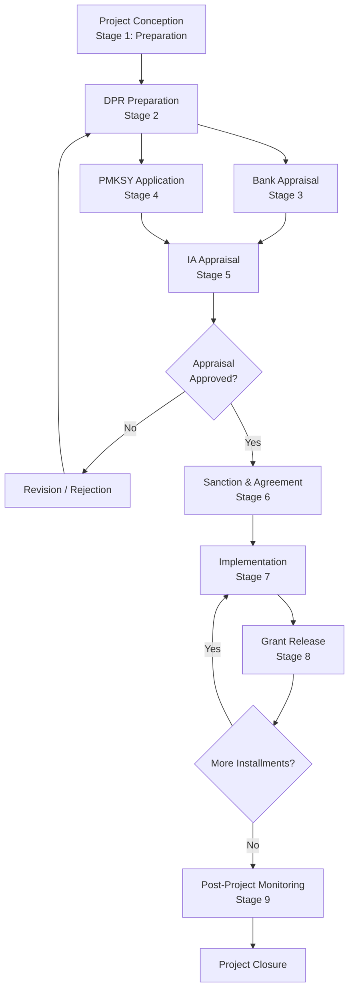

# Application Workflow

## Overview

This document describes the complete end-to-end PMKSY application workflow for a chocolate manufacturing project in Andhra Pradesh — from initial project preparation through PMKSY sanction, bank appraisal, grant release, and post-submission follow-up. It defines each workflow stage, responsible stakeholders, inputs, outputs, decision points, required documents, and typical timelines.

**OFFICIAL** — PMKSY applications follow a structured process designed to ensure that only eligible, technically feasible, financially viable, and compliant projects receive sanction. The workflow integrates applicant, bank, and implementing agency activities.

> **SCOPE BOUNDARY**: This document describes the **application process workflow**. It does **not** address:
> - Eligibility criteria (see [PMKS-002: Project Eligibility](PMKSY_MASTER/02_PROJECT_ELIGIBILITY.md))
> - Applicant qualifications (see [PMKS-003: Applicant Eligibility](PMKSY_MASTER/03_APPLICANT_ELIGIBILITY.md))
> - Entity requirements (see [PMKS-004: Entity Eligibility](PMKSY_MASTER/04_ENTITY_ELIGIBILITY.md))
> - Land requirements (see [PMKS-005: Land Eligibility](PMKSY_MASTER/05_LAND_ELIGIBILITY.md))
> - Cost eligibility (see [PMKS-006: Eligible Project Cost](PMKSY_MASTER/06_ELIGIBLE_PROJECT_COST.md))
> - Document lists (see [PMKS-007: Required Documents](PMKSY_MASTER/07_REQUIRED_DOCUMENTS.md))

---

## Workflow Overview

### High-Level PMKSY Process Flow

**PROJECT ASSUMPTION** — The PMKSY application process for a chocolate manufacturing unit involves the following high-level stages:

```
PROJECT CONCEPTION → PREPARATION → PRE-APPLICATION → APPLICATION → 
APPRAISAL → SANCTION → IMPLEMENTATION → GRANT RELEASE → 
POST-PROJECT MONITORING
```

### Stakeholder Roles

| Stakeholder | Role | Responsibility |
|-------------|------|----------------|
| Applicant / Promoter | Project owner | Project conception, DPR preparation, application submission, implementation |
| Technical Consultant | Process design | DPR preparation, technical feasibility, equipment selection |
| Financial Consultant | Financial advisory | Cost estimation, financial projections, bank liaison |
| Bank / Financial Institution | Term loan provider | Project appraisal, loan sanction, disbursement, monitoring |
| Implementing Agency (IA) | PMKSY nodal agency | Application processing, appraisal, sanction, monitoring, grant release |
| MoFPI | Scheme owner | Policy oversight, fund release to IA, overall monitoring |
| Regulatory Authorities | Compliance | FSSAI, BIS, SPCB, Fire, Local Authority |

---

## Stage 1: Project Preparation

### Purpose
Define project scope, conduct preliminary studies, and establish project viability before committing to formal application.

### Responsible Stakeholder
Applicant / Promoter, supported by Technical Consultant and Financial Consultant

### Inputs
| Input | Source | Status |
|-------|--------|--------|
| Project concept / business idea | Applicant | OFFICIAL |
| Preliminary land availability | Seller / Revenue Dept | PROJECT ASSUMPTION |
| Promoter net worth statement | Chartered Accountant | OFFICIAL |
| Rough order of magnitude cost | Quantity Surveyor | PROJECT ASSUMPTION |
| Indicative technology options | OEMs / Consultants | PROJECT ASSUMPTION |

### Activities
1. Define project scope and objectives
2. Conduct site feasibility assessment
3. Prepare preliminary market assessment
4. Engage technical and financial consultants
5. Prepare indicative project cost estimate
6. Verify promoter financial capability
7. Confirm land availability and basic feasibility

### Outputs
| Output | Description | Status |
|--------|-------------|--------|
| Project concept note | High-level project description | PROJECT ASSUMPTION |
| Site suitability report | Land and location assessment | PROJECT ASSUMPTION |
| Preliminary market assessment | Demand and supply analysis | PROJECT ASSUMPTION |
| Indicative cost estimate | Rough project cost | PROJECT ASSUMPTION |
| Promoter net worth certificate | Financial capability proof | OFFICIAL |

### Decision Points
| Decision | Criteria | Action if FAIL |
|----------|----------|----------------|
| Is project viable? | Technical + financial feasibility | Terminate or redesign |
| Is land suitable? | Location, area, land-use | Identify alternate site |
| Is promoter financially capable? | Net worth adequate | Reconsider promoter structure |
| Is market demand adequate? | Realistic demand assessment | Reconsider product mix |

### Documents Required (Pre-Application)
See [PMKS-007: Required Documents](PMKSY_MASTER/07_REQUIRED_DOCUMENTS.md) — Pre-application stage.

### Typical Timeline
**REQUIRES RE-VERIFICATION** — Project preparation typically takes 4-8 weeks for a ₹2 crore unit, depending on land availability and consultant engagement.

---

## Stage 2: DPR Preparation

### Purpose
Prepare a comprehensive Detailed Project Report (DPR) that satisfies both PMKSY and bank requirements.

### Responsible Stakeholder
Applicant / Promoter (with Technical Consultant and Financial Consultant)

### Inputs
| Input | Source | Status |
|-------|--------|--------|
| Project concept note | Stage 1 output | PROJECT ASSUMPTION |
| Site suitability report | Stage 1 output | PROJECT ASSUMPTION |
| Land documents | Applicant | OFFICIAL |
| Technology discussions | OEMs | PROJECT ASSUMPTION |
| Vendor quotations | OEMs | PROJECT ASSUMPTION |
| Promoter financials | Chartered Accountant | OFFICIAL |

### Activities
1. Finalize technology selection and process design
2. Prepare detailed engineering design (layouts, P&IDs, equipment lists)
3. Obtain vendor quotations for major equipment
4. Prepare detailed cost estimates (itemized)
5. Prepare financial projections (P&L, cash flow, balance sheet)
6. Conduct market analysis in depth
7. Prepare implementation schedule
8. Prepare environmental impact assessment (if required)
9. Ensure all statutory compliance requirements identified
10. Compile all supporting documents

### Outputs
| Output | Description | Status |
|--------|-------------|--------|
| Detailed Project Report (DPR) | Comprehensive project report | OFFICIAL |
| Equipment quotations | Vendor pricing | PROJECT ASSUMPTION |
| Cost estimation sheets | Itemized cost breakup | PROJECT ASSUMPTION |
| Financial projections | 5-year projections | PROJECT ASSUMPTION |
| Implementation schedule | Gantt chart with milestones | PROJECT ASSUMPTION |
| Environmental assessment | EIA / EMP (if required) | PROJECT ASSUMPTION |
| Statutory compliance matrix | Checklist of required approvals | PROJECT ASSUMPTION |

### Decision Points
| Decision | Criteria | Action if FAIL |
|----------|----------|----------------|
| Is DPR technically sound? | Consultant sign-off | Revise design |
| Are costs reasonable? | Bank / market verification | Revise estimates |
| Are financial projections viable? | Debt-service coverage, IRR | Redesign financial structure |
| Are all documents in order? | Completeness check | Obtain missing documents |
| Is environmental clearance needed? | Project scale and category | Initiate EIA process |

### Documents Required
See [PMKS-007: Required Documents](PMKSY_MASTER/07_REQUIRED_DOCUMENTS.md) — Application stage.

### Typical Timeline
**REQUIRES RE-VERIFICATION** — DPR preparation typically takes 4-8 weeks for a ₹2 crore chocolate manufacturing unit. Environmental clearance (if required) adds 2-6 months.

---

## Stage 3: Bank Appraisal (Parallel Track)

### Purpose
Obtain term loan sanction from a bank or financial institution. This track runs parallel to PMKSY application preparation.

### Responsible Stakeholder
Applicant / Promoter (with Bank)

### Inputs
| Input | Source | Status |
|-------|--------|--------|
| DPR / project report | Stage 2 output | OFFICIAL |
| Applicant KYC | Applicant | OFFICIAL |
| Financial statements | Chartered Accountant | OFFICIAL |
| Land documents | Applicant | OFFICIAL |
| Security / collateral documents | Applicant | OFFICIAL |

### Activities
1. Submit loan application to bank
2. Bank conducts KYC and initial screening
3. Bank appoints valuer for collateral assessment
4. Bank appoints consultant for technical appraisal (if needed)
5. Bank conducts site visit
6. Bank prepares appraisal report
7. Bank sanctions term loan
8. Bank issues sanction letter

### Outputs
| Output | Description | Status |
|--------|-------------|--------|
| Bank appraisal letter | Term loan sanction | BANK PRACTICE |
| Bank sanction letter | Loan terms and conditions | BANK PRACTICE |
| Valuation report | Collateral valuation | BANK PRACTICE |
| Legal opinion (title/entity) | Legal compliance | BANK PRACTICE |

### Decision Points
| Decision | Criteria | Action if FAIL |
|----------|----------|----------------|
| Is project bankable? | Technical + financial viability | Revise DPR or seek different bank |
| Is collateral adequate? | Loan-to-value ratio | Restructure security |
| Is promoter creditworthy? | CIBIL, financial track record | Address credit issues or change promoter structure |

### Documents Required
See [PMKS-007: Required Documents](PMKSY_MASTER/07_REQUIRED_DOCUMENTS.md) — Bank appraisal stage.

### Typical Timeline
**REQUIRES RE-VERIFICATION** — Bank appraisal typically takes 4-8 weeks from loan application to sanction for a ₹2 crore project. Some banks may require MoFPI in-principle approval before final sanction.

---

## Stage 4: PMKSY Application Submission

### Purpose
Submit complete PMKSY application with all required documents to the implementing agency.

### Responsible Stakeholder
Applicant / Promoter

### Inputs
| Input | Source | Status |
|-------|--------|--------|
| Completed DPR | Stage 2 output | OFFICIAL |
| Bank appraisal letter | Stage 3 output | BANK PRACTICE |
| Applicant and entity documents | Applicant | OFFICIAL |
| Land documents | Applicant | OFFICIAL |
| Cost estimates and quotations | Stage 2 | PROJECT ASSUMPTION |

### Activities
1. Obtain current PMKSY application form from implementing agency
2. Compile complete application package per [PMKS-007: Required Documents](PMKSY_MASTER/07_REQUIRED_DOCUMENTS.md)
3. Submit application online (if portal-based) or physically to implementing agency
4. Obtain acknowledgement receipt with application reference number
5. Track application status through implementing agency portal or contacts

### Outputs
| Output | Description | Status |
|--------|-------------|--------|
| Application submission receipt | Acknowledgement from IA | PROJECT ASSUMPTION |
| Application reference number | Tracking ID | PROJECT ASSUMPTION |
| Query letter (if any) | IA requests clarifications | PROJECT ASSUMPTION |
| Pre-seminar / pre-scrutiny meeting | Applicant presentation to IA | PROJECT ASSUMPTION |

### Decision Points
| Decision | Criteria | Action if FAIL |
|----------|----------|----------------|
| Is application complete? | All documents in order | Submit missing documents |
| Does IA accept application? | Preliminary scrutiny | Address IA queries |
| Is project placed for appraisal? | IA screening | Revise and resubmit |

### Documents Required
See [PMKS-007: Required Documents](PMKSY_MASTER/07_REQUIRED_DOCUMENTS.md) — Application stage.

### Typical Timeline
**REQUIRES RE-VERIFICATION** — Application submission is typically accepted throughout the year or during specified windows. Confirm current-year application window with implementing agency.

---

## Stage 5: Appraisal by Implementing Agency

### Purpose
Implementing agency conducts technical, financial, and project appraisal of the application.

### Responsible Stakeholder
Implementing Agency, with applicant support

### Inputs
| Input | Source | Status |
|-------|--------|--------|
| Complete PMKSY application | Stage 4 output | OFFICIAL |
| DPR | Stage 2 output | OFFICIAL |
| Bank appraisal letter | Stage 3 output | BANK PRACTICE |

### Activities
1. Preliminary scrutiny of application completeness
2. Technical appraisal by IA technical team
3. Financial appraisal by IA finance team
4. Site visit by IA officials (if required)
5. Clarification queries sent to applicant (if needed)
6. Evaluation against PMKSY eligibility criteria
7. Preparation of appraisal note / recommendation
8. Placement before appropriate authority for approval

### Outputs
| Output | Description | Status |
|--------|-------------|--------|
| Appraisal note / report | IA evaluation | PROJECT ASSUMPTION |
| Clarification response | Applicant responses to queries | PROJECT ASSUMPTION |
| Approval recommendation | Forwarded to sanctioning authority | PROJECT ASSUMPTION |

### Decision Points
| Decision | Criteria | Action if FAIL |
|----------|----------|----------------|
| Is project technically feasible? | IA technical review | Clarify or revise design |
| Is project financially viable? | IA financial review | Clarify assumptions |
| Does project meet eligibility? | All eligibility criteria | Address gaps or withdraw |
| Is appraisal recommended? | Overall assessment | Reject or request revision |

### Documents Required
See [PMKS-007: Required Documents](PMKSY_MASTER/07_REQUIRED_DOCUMENTS.md) — Application stage.

### Typical Timeline
**REQUIRES RE-VERIFICATION** — IA appraisal typically takes 4-12 weeks from application submission, depending on IA workload and project complexity.

---

## Stage 6: Sanction and Agreement Execution

### Purpose
Formal approval of PMKSY assistance and execution of implementation agreement.

### Responsible Stakeholder
Implementing Agency (sanction) and both parties (agreement)

### Inputs
| Input | Source | Status |
|-------|--------|--------|
| IA appraisal recommendation | Stage 5 output | PROJECT ASSUMPTION |
| Approved project cost / EPC | MoFPI / IA | OFFICIAL |
| Applicant documents | Applicant | OFFICIAL |
| Bank sanction letter | Stage 3 output | BANK PRACTICE |

### Activities
1. Sanctioning authority approves project
2. PMKSY sanction letter issued to applicant
3. PMKSY agreement / MoU executed between IA and applicant
4. Bank sanction letter issued (if not already)
5. Insurance policies activated
6. Land registration / lease formalized
7. Project account (escrow) opened
8. Commencement of project implementation

### Outputs
| Output | Description | Status |
|--------|-------------|--------|
| PMKSY sanction letter | Official approval | OFFICIAL |
| PMKSY agreement | Implementation terms | OFFICIAL |
| Bank sanction letter | Term loan approval | BANK PRACTICE |
| Insurance policies | Risk coverage | OFFICIAL |
| Land registration / lease | Land secured | OFFICIAL |
| Commencement certificate | Construction start | PROJECT ASSUMPTION |

### Decision Points
| Decision | Criteria | Action if FAIL |
|----------|----------|----------------|
| Are sanction conditions acceptable? | Review terms | Negotiate or withdraw |
| Is agreement signed? | Both parties agree | Revise terms or terminate |
| Is bank loan sanctioned? | Bank approval | Seek alternative financing |
| Are insurance policies in place? | Coverage confirmed | Obtain required coverage |

### Documents Required
See [PMKS-007: Required Documents](PMKSY_MASTER/07_REQUIRED_DOCUMENTS.md) — Sanction stage.

### Typical Timeline
**REQUIRES RE-VERIFICATION** — Sanction typically follows within 2-4 weeks of IA recommendation approval.

---

## Stage 7: Project Implementation

### Purpose
Execute the project as per approved DPR, sanctioned cost, and timeline.

### Responsible Stakeholder
Applicant / Project Implementation Agency (PIA)

### Inputs
| Input | Source | Status |
|-------|--------|--------|
| PMKSY sanction letter | Stage 6 output | OFFICIAL |
| PMKSY agreement | Stage 6 output | OFFICIAL |
| Bank loan disbursement | Stage 6 output | BANK PRACTICE |
| Approved DPR | Stage 2 output | OFFICIAL |

### Activities
1. Commence civil works
2. Procure and install plant and machinery
3. Complete electrical and utility installations
4. Install laboratory and QC equipment
5. Conduct trial runs and commissioning
6. Obtain operational clearances
7. Prepare interim progress reports
8. Coordinate with bank for loan disbursement
9. Coordinate with IA for subsidy release
10. Maintain project accounts and records

### Outputs
| Output | Description | Status |
|--------|-------------|--------|
| Physical project assets | Buildings, machinery, utilities | OFFICIAL |
| Commissioning reports | Trial run results | PROJECT ASSUMPTION |
| Progress reports | Periodic status updates | PROJECT ASSUMPTION |
| Expenditure records | Invoices, bills, receipts | OFFICIAL |

### Decision Points
| Decision | Criteria | Action if FAIL |
|----------|----------|----------------|
| Is project on schedule? | Milestone tracking | Accelerate or seek extension |
| Is expenditure within sanctioned cost? | Cost control | Revise or seek additional funds |
| Are quality standards met? | Equipment / construction QC | Rectify deficiencies |
| Is bank disbursement on track? | Loan drawdown schedule | Coordinate with bank |

### Documents Required
See [PMKS-007: Required Documents](PMKSY_MASTER/07_REQUIRED_DOCUMENTS.md) — Grant release stage (for each installment).

### Typical Timeline
**REQUIRES RE-VERIFICATION** — Implementation typically takes 12-24 months for a ₹2 crore chocolate manufacturing unit, depending on project complexity and supply chain factors.

---

## Stage 8: Grant Release

### Purpose
Release of PMKSY subsidy in installments tied to project milestones.

### Responsible Stakeholder
Implementing Agency (subsidy), Bank (loan disbursement), Applicant (coordination)

### Inputs
| Input | Source | Status |
|-------|--------|--------|
| Progress report | Applicant | PROJECT ASSUMPTION |
| Expenditure proof (invoices) | Vendors / Contractors | OFFICIAL |
| Bank certificate | Bank | BANK PRACTICE |
| Site inspection report | IA | OFFICIAL |
| Utilization certificate | Chartered Accountant | OFFICIAL |

### Activities
1. Applicant submits utilization certificate and expenditure proof for installment
2. Bank certifies expenditure and issues no-due certificate
3. IA conducts site inspection
4. IA verifies expenditure against sanctioned EPC
5. IA releases subsidy installment
6. Bank releases corresponding loan installment
7. Cycle repeats for each milestone

### Outputs
| Output | Description | Status |
|--------|-------------|--------|
| Subsidy disbursement | PMKSY subsidy released | OFFICIAL |
| Loan disbursement | Bank term loan released | BANK PRACTICE |
| Utilization certificate | Certified expenditure | OFFICIAL |

### Decision Points
| Decision | Criteria | Action if FAIL |
|----------|----------|----------------|
| Is expenditure eligible? | Against sanctioned EPC | Release only eligible portion |
| Is physical progress adequate? | Site inspection | Release on satisfactory progress |
| Has bank confirmed disbursement? | Bank certificate | Coordinate with bank |

### Documents Required
See [PMKS-007: Required Documents](PMKSY_MASTER/07_REQUIRED_DOCUMENTS.md) — Grant release stage.

### Typical Timeline
**REQUIRES RE-VERIFICATION** — Subsidy is typically released in 2-4 installments over the implementation period. Each installment cycle takes 4-8 weeks from application to release.

---

## Stage 9: Post-Submission Follow-Up

### Purpose
Track application status, respond to queries, and ensure smooth progression through approval stages.

### Responsible Stakeholder
Applicant / Promoter

### Inputs
| Input | Source | Status |
|-------|--------|--------|
| Application reference number | Stage 4 | PROJECT ASSUMPTION |
| Query letters (if any) | IA | PROJECT ASSUMPTION |
| Status tracking information | IA portal / contacts | PROJECT ASSUMPTION |

### Activities
1. Monitor application status through IA portal
2. Respond promptly to IA queries (typically within 7-14 days)
3. Attend IA seminars / presentations if scheduled
4. Maintain communication with IA nodal officer
5. Update IA on any material changes (cost, timeline, promoter)
6. Escalate delays through proper channels if application stalls

### Outputs
| Output | Description | Status |
|--------|-------------|--------|
| Query responses | Clarifications to IA | PROJECT ASSUMPTION |
| Updated documents (if requested) | Revised submissions | PROJECT ASSUMPTION |
| Status confirmation | Application progression | PROJECT ASSUMPTION |

### Decision Points
| Decision | Criteria | Action if FAIL |
|----------|----------|----------------|
| Is application progressing? | Timeline tracking | Escalate to higher IA authority |
| Are queries being resolved? | Response adequacy | Seek legal/technical help |
| Is additional information needed? | IA requirements | Submit promptly |

### Documents Required
Varies by IA requirements. Maintain all application documents accessible for quick reference.

### Typical Timeline
**REQUIRES RE-VERIFICATION** — Post-submission follow-up is continuous until sanction. Applicants should check status weekly during appraisal phase.

---

## Integrated Workflow Summary

### End-to-End Process Table

| Stage | Primary Owner | Parallel Activities | Typical Duration | Key Deliverable |
|-------|---------------|---------------------|------------------|-----------------|
| 1. Project Preparation | Applicant | Consultant engagement | 4-8 weeks | Feasibility report |
| 2. DPR Preparation | Consultant | Vendor discussions | 4-8 weeks | DPR |
| 3. Bank Appraisal | Bank | DPR review | 4-8 weeks | Bank sanction |
| 4. Application Submission | Applicant | DPR finalization | 1-2 weeks | Submitted application |
| 5. IA Appraisal | IA | Query resolution | 4-12 weeks | Appraisal note |
| 6. Sanction | IA | Agreement execution | 2-4 weeks | PMKSY sanction |
| 7. Implementation | Applicant | Bank + IA coordination | 12-24 months | Completed project |
| 8. Grant Release | IA + Bank | Milestone certification | 4-8 weeks per installment | Subsidy disbursed |
| 9. Post-Project Monitoring | IA + Applicant | Annual reporting | 3-5 years | Project closure |

**REQUIRES RE-VERIFICATION** — These timelines are illustrative. Confirm actual timelines with implementing agency for current-year call.

---

## Common Applicant Mistakes

### Mistake 1: Starting PMKSY Application Too Early
- **Error**: Applying before project concept is firm or land is secured
- **Prevention**: Complete project preparation (Stage 1) before DPR engagement

### Mistake 2: Incomplete Document Package
- **Error**: Submitting application with missing documents
- **Prevention**: Use [PMKS-007: Required Documents](PMKSY_MASTER/07_REQUIRED_DOCUMENTS.md) checklist; verify completeness before submission

### Mistake 3: Delaying Bank Appraisal
- **Error**: Waiting for PMKSY sanction before approaching bank
- **Prevention**: Run bank appraisal in parallel with PMKSY application (Stage 3 parallel to Stage 4-5)

### Mistake 4: Ignoring IA Queries
- **Error**: Delaying responses to implementing agency queries
- **Prevention**: Monitor application status weekly; respond to queries within 7 days

### Mistake 5: Over-Optimistic Timelines
- **Error**: Underestimating DPR preparation, environmental clearance, or implementation time
- **Prevention**: Add 20-30% contingency to all timelines

### Mistake 6: Underestimating Cost
- **Error**: Low-balling project cost to accelerate approval
- **Prevention**: Use realistic market rates; bank and IA independently verify costs

### Mistake 7: Poor Consultant Selection
- **Error**: Choosing consultant based on cost alone
- **Prevention**: Select consultant with food processing and PMKSY experience; verify track record

### Mistake 8: Missing Compliance Requirements
- **Error**: Focusing only on PMKSY and forgetting FSSAI, BIS, environmental, labor requirements
- **Prevention**: Include compliance matrix in DPR; track separately in [PMKS-013: Compliance](PMKSY_MASTER/13_COMPLIANCE.md)

---

## Process Flow Diagram



---

## Relationship with Other Documents

| This Document | Related Document | Relationship |
|---------------|------------------|--------------|
| Project Eligibility | [PMKS-002](PMKSY_MASTER/02_PROJECT_ELIGIBILITY.md) | Eligibility must be established before application |
| Applicant Eligibility | [PMKS-003](PMKSY_MASTER/03_APPLICANT_ELIGIBILITY.md) | Applicant must be eligible |
| Entity Eligibility | [PMKS-004](PMKSY_MASTER/04_ENTITY_ELIGIBILITY.md) | Entity must be eligible |
| Land Eligibility | [PMKS-005](PMKSY_MASTER/05_LAND_ELIGIBILITY.md) | Land must be eligible |
| Eligible Project Cost | [PMKS-006](PMKSY_MASTER/06_ELIGIBLE_PROJECT_COST.md) | Costs must be classified before DPR |
| Required Documents | [PMKS-007](PMKSY_MASTER/07_REQUIRED_DOCUMENTS.md) | Documents are workflow inputs |
| Implementing Agencies | [PMKS-009](PMKSY_MASTER/09_IMPLEMENTING_AGENCIES.md) | IA processes this workflow |
| Project Appraisal | [PMKS-010](PMKSY_MASTER/10_PROJECT_APPRAISAL.md) | Bank appraisal embedded in workflow |
| Grant Release | [PMKS-011](PMKSY_MASTER/11_GRANT_RELEASE.md) | Subsidy release is Stage 8 |
| Post-Project Monitoring | [PMKS-012](PMKSY_MASTER/12_POST_PROJECT_MONITORING.md) | Stage 9 of workflow |

---

## Official References

### Primary Sources (OFFICIAL)

| Source | Document | Access Date | Status |
|--------|----------|-------------|--------|
| MoFPI | PMKSY Scheme Guidelines 2016 (Extended to 2025-26) | 2026-06-30 | Active |

### Secondary Sources

| Source | Usage | Basis |
|--------|-------|-------|
| NABARD | Bank appraisal timelines and practices | BANK PRACTICE |
| Implementing agencies | Application processing timelines | REQUIRES RE-VERIFICATION |
| Industry practice | DPR preparation timelines, implementation schedules | PROJECT ASSUMPTION |

---

## Revision History

| Version | Date | Author | Changes |
|---------|------|--------|---------|
| 1.0.0 | 2026-06-30 | Program Manager | Initial creation — comprehensive PMKSY application workflow for chocolate manufacturing projects |

---

## Document Control

**Document Owner**: Program Manager  
**Review Cycle**: Quarterly, or upon MoFPI guideline or process changes  
**Next Review Due**: 2026-09-30  
**Archive When**: Superseded by PMKSY-2027 guidelines or workflow reorganization

---